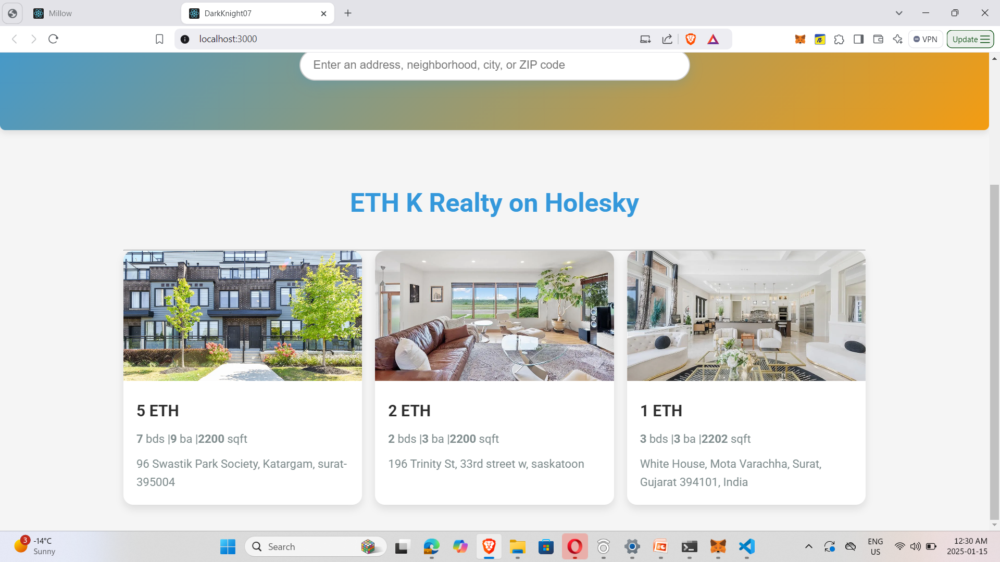

# Real Estate NFT DApp on Holesky testnet

## Technology Stack & Tools

- Solidity (Writing Smart Contracts & Tests)
- Javascript (React & Testing)
- [Hardhat](https://hardhat.org/) (Development Framework)
- [Ethers.js](https://docs.ethers.io/v5/) (Blockchain Interaction)
- [React.js](https://reactjs.org/) (Frontend Framework)

## Requirements For Initial Setup
- Install [NodeJS](https://nodejs.org/en/)

## Setting Up

### 1. Clone/Download the Repository

### 2. Install Dependencies:
`$ npm install`

### 3. Run tests
`$ npx hardhat test`

### 4.Change envirnmental variables
`$ private key of provifders account `
`$ you will require 4 accounts with sufficiant holesky test ethers in it `

### 5. Run deployment script
In a separate terminal execute:
`$ npx hardhat run ./scripts/deploy.js --network holesky`

### 7. Start frontend
`$ npm run start`

### 8. User Interface
